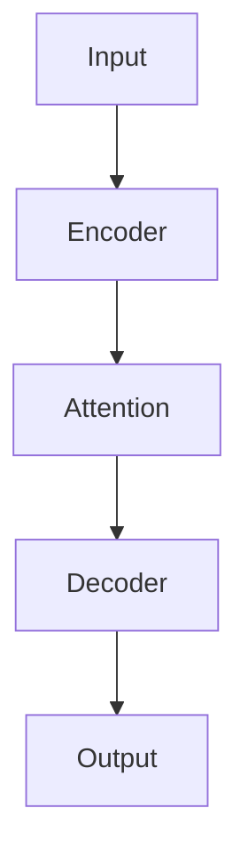

# Summarizing Academic Papers

This skill helps you create clear, useful summaries of academic papers.

## Summary Levels

### Brief (TL;DR)
- 2-3 sentences
- Answer: What problem? What solution? What result?
- Good for: Quick understanding, deciding whether to read

### Standard
- 1 paragraph (5-8 sentences)
- Cover: Motivation, approach, key method, main results
- Good for: Understanding the paper's contribution

### Detailed
- 3-5 paragraphs
- Full coverage: Background, methodology, experiments, findings, implications
- Good for: Deep understanding without reading the full paper

## Instructions by Level

### Brief Summary Template

```
[PAPER TITLE] addresses [PROBLEM]. The authors propose [METHOD/APPROACH],
which [KEY INSIGHT]. Experiments show [MAIN RESULT].
```

Example:
> "Attention Is All You Need" addresses sequence-to-sequence modeling without
> recurrence. The authors propose the Transformer, which relies entirely on
> self-attention mechanisms. Experiments show state-of-the-art translation
> quality with significantly faster training.

### Standard Summary Structure

1. **Opening** - Paper title, problem context, why it matters
2. **Approach** - What the authors propose, key innovation
3. **Method** - How it works (high level)
4. **Results** - Main experimental findings
5. **Conclusion** - Significance and implications

### Detailed Summary Structure

**Paragraph 1: Background & Motivation**
- What is the problem domain?
- Why is this problem important?
- What are the limitations of existing approaches?

**Paragraph 2: Proposed Approach**
- What is the core idea?
- What are the key components?
- What makes this approach novel?

**Paragraph 3: Methodology Details**
- How does the method work?
- What are the key technical choices?
- What are the important equations/algorithms?

**Paragraph 4: Experiments & Results**
- What datasets/benchmarks were used?
- What baselines were compared?
- What were the main findings?

**Paragraph 5: Discussion & Impact**
- What are the limitations?
- What are the implications?
- What future work does this enable?

## Key Takeaways Section

Always end with 3-5 bullet points:

```
### Key Takeaways
- [Most important contribution]
- [Key technical insight]
- [Main result/finding]
- [Practical implication]
- [Limitation to be aware of]
```

## Visual Elements

### Figure References
Include references to key figures from the paper based on summary level:
- **Brief summaries**: Mention 1 key figure if highly relevant
- **Standard summaries**: Reference 2-3 important figures with brief context
- **Detailed summaries**: Reference all important figures and provide context for each

Reference format:
- **Figure X (Page Y)**: [Brief description of what the figure shows and why it's important]

Example:
> **Figure 1 (Page 3)**: Model architecture showing the Transformer encoder-decoder structure with attention layers
> **Figure 3 (Page 7)**: Performance comparison across benchmarks, demonstrating 15% improvement over baselines

### Conceptual Diagrams
For **Detailed summaries**, generate a mermaid diagram to visualize the core concept:
- Keep diagrams simple (5-10 nodes maximum)
- Use clear, descriptive labels
- Focus on the main flow/process/relationship
- Use appropriate diagram types:
  - `flowchart TD` for architectures and workflows
  - `flowchart LR` for pipelines and data flow
  - `graph TD` for hierarchies and relationships

Example format in output:
```
### Core Architecture

```

## Tips for Good Summaries

1. **Lead with the contribution** - Don't bury the main point
2. **Use concrete numbers** - "Improves by 5%" not "significantly improves"
3. **Explain jargon** - Make it accessible
4. **Be accurate** - Don't overclaim or underclaim results
5. **Preserve nuance** - Mention limitations and conditions
6. **Match the audience** - Technical for researchers, accessible for general

## What NOT to Include

- Excessive background that's not specific to this paper
- Every experiment (focus on main results)
- Implementation details (unless that's the contribution)
- Future work section (unless specifically asked)
- Author biographies or acknowledgments
