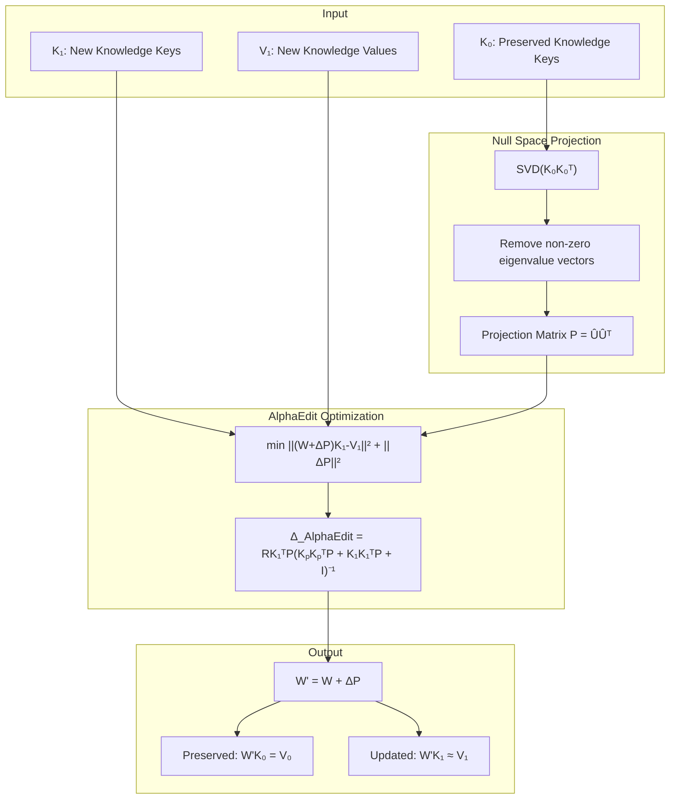
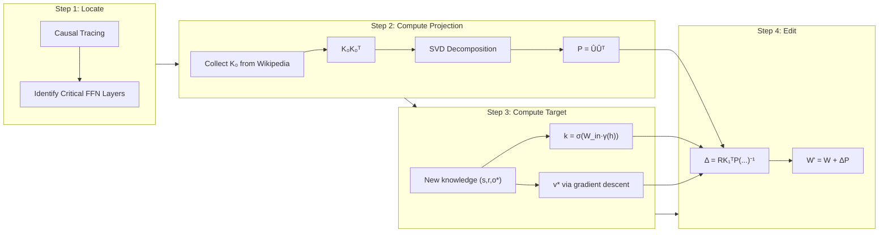
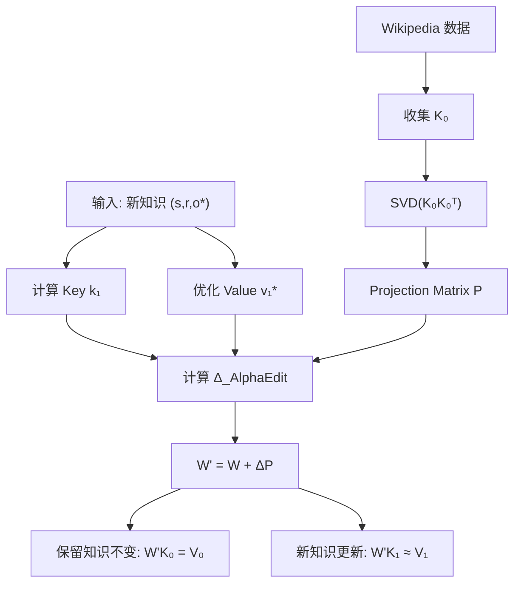

# Paper Analysis Report / 论文分析报告

**Source / 来源:** pdf/2410.02355v4.pdf (AlphaEdit: Null-Space Constrained Knowledge Editing for Language Models)
**Generated / 生成时间:** 2026-02-03
**Venue:** ICLR 2025

---

# English Version

## Summary

### Overview
**AlphaEdit** introduces a novel approach to knowledge editing in Large Language Models (LLMs) that addresses the critical challenge of balancing knowledge updates with knowledge preservation. The method projects parameter perturbations onto the **null space** of preserved knowledge before applying them, ensuring that edits don't disrupt existing knowledge.

### Problem & Motivation
Current model editing methods follow a "locate-then-edit" paradigm that struggles to balance:
- **Knowledge-update error (e₁)**: Error when recalling updated knowledge
- **Knowledge-preservation error (e₀)**: Error when recalling preserved knowledge

This imbalance leads to **model forgetting** and **model collapse** in sequential editing scenarios, where hidden representations shift dramatically from their original distribution.

### Key Innovation
AlphaEdit removes e₀ from the optimization objective entirely and instead projects the perturbation Δ onto the null space of K₀ (the key matrix encoding preserved knowledge). This ensures:
- (W + Δ')K₀ = WK₀ = V₀ (preserved knowledge unchanged)
- The model can focus solely on minimizing e₁

### Main Results
- **36.7% average improvement** over best baselines across multiple LLMs
- Only requires **one line of code** modification to existing methods like MEMIT
- Maintains model fluency and coherence even after 3000+ sequential edits
- Preserves hidden representation distribution stability

### Key Takeaways
- Null-space projection decouples knowledge update from preservation
- Simple mathematical insight leads to dramatic performance gains
- Plug-and-play enhancement for existing editing methods (MEMIT, PRUNE, RECT)
- Prevents catastrophic forgetting in sequential editing scenarios
- Computationally efficient - projection matrix computed once, reused indefinitely

### Key Figures Reference
- **Figure 1 (Page 2)**: Comparison between current methods and AlphaEdit showing objectives, hidden representation distributions, and output degradation examples
- **Figure 2 (Page 2)**: Radar chart demonstrating AlphaEdit's superior performance across all metrics on LLaMA3-8B
- **Figure 5 (Page 8)**: t-SNE visualization showing AlphaEdit maintains hidden representation distribution while baselines cause significant shifts

### Core Architecture Diagram


---

## Detailed Analysis

### 1. Core Methodology

**Locate-then-Edit Paradigm:**
The paper builds on the understanding that FFN layers in transformers act as key-value memories:
- Keys (k) encode subject-relation pairs (s, r)
- Values (v) encode objects (o)
- W_out associates keys with values: m = W_out · σ(W_in · γ(h))

**Null Space Theory:**
- Given matrices A and B, B is in the null space of A iff BA = 0
- If Δ' is in null space of K₀, then Δ'K₀ = 0
- Therefore: (W + Δ')K₀ = WK₀ = V₀ (preserved knowledge intact)

**Projection Implementation:**
1. Compute K₀K₀ᵀ (covariance matrix, d₀ × d₀)
2. Apply SVD: {U, Λ, Uᵀ} = SVD(K₀K₀ᵀ)
3. Remove eigenvectors with eigenvalues > 10⁻²
4. Form projection matrix: P = Û(Û)ᵀ

### 2. Key Contributions

1. **Theoretical Guarantee**: Proves that null-space projection ensures preserved knowledge associations remain unchanged
2. **Minimal Code Change**: Single line modification to existing methods
3. **Significant Performance Boost**: 36.7% average improvement
4. **Plug-and-Play**: Works with MEMIT, PRUNE, RECT, and other methods
5. **Prevents Collapse**: Maintains hidden representation stability

### 3. Strengths

**Technical Strengths:**
- Elegant mathematical formulation with rigorous proofs
- Computationally efficient - O(d₀³) for SVD, computed once
- Theoretically grounded solution to a practical problem

**Experimental Strengths:**
- Comprehensive evaluation: 3 LLMs (LLaMA3-8B, GPT-J-6B, GPT2-XL)
- Multiple datasets: Counterfact, ZsRE, KnowEdit, LEME, MQuAKE
- Extensive ablation studies and sensitivity analysis
- General capability tests on 6 NLU tasks
- Hidden representation analysis with t-SNE

**Practical Strengths:**
- Easy to implement (one line of code)
- No additional training required
- Negligible runtime overhead (Table 7: ~1s difference per 100 edits)

### 4. Weaknesses and Limitations

**Technical Concerns:**
- K₀ estimation relies on 100,000 Wikipedia triplets - may not capture full knowledge
- Eigenvalue threshold (10⁻²) is empirically chosen
- Specificity degrades significantly when K₀ dataset size is reduced (Table 6)

**Experimental Gaps:**
- Not tested on multi-modal LLMs or reasoning models
- Maximum 3000 sequential edits - unclear behavior at larger scales
- Memory-based methods sometimes achieve higher Specificity/Fluency

**Scope Limitations:**
- Assumes FFN layers are primary knowledge storage
- Focus on factual knowledge; unclear for procedural/reasoning knowledge

### 5. Technical Details

**Key Equations:**

Original MEMIT solution:
```
Δ_MEMIT = RK₁ᵀ(KₚKₚᵀ + K₁K₁ᵀ + K₀K₀ᵀ)⁻¹
```

AlphaEdit solution:
```
Δ_AlphaEdit = RK₁ᵀP(KₚKₚᵀP + K₁K₁ᵀP + I)⁻¹
```
Where R = V₁ - WK₁ (residual)

**Hyperparameters:**
| Model | Layers | λ | Steps | Learning Rate |
|-------|--------|---|-------|---------------|
| LLaMA3-8B | [4,5,6,7,8] | 15,000 | 25 | 0.1 |
| GPT-J-6B | [3,4,5,6,7,8] | 15,000 | 25 | 0.5 |
| GPT2-XL | [13,14,15,16,17] | 20,000 | 20 | 0.5 |

**Key Results (Table 1, 2000 edits on Counterfact):**
| Method | Efficacy | Generalization | Fluency | Consistency |
|--------|----------|----------------|---------|-------------|
| MEMIT | 65.65% | 64.65% | 437.43 | 6.58 |
| RECT | 66.05% | 63.62% | 526.62 | 20.54 |
| **AlphaEdit** | **98.90%** | **94.22%** | **622.49** | **32.40** |

### 6. Key Figures Reference

- **Figure 1 (Page 2)**: Core comparison showing (a) different objectives, (b)(e) hidden representation distributions before/after editing, (c) example of model collapse ("The largest ocean is is is is...")

- **Figure 3 (Page 5)**: Side-by-side comparison of MEMIT vs AlphaEdit optimization paradigms

- **Figure 4 (Page 7)**: F1 scores on general capability tasks showing AlphaEdit maintains performance while baselines degrade to near-zero after 2000 edits

- **Figure 5 (Page 8)**: t-SNE visualization demonstrating distribution preservation with marginal distribution curves

- **Figure 6 (Page 9)**: Performance improvements when adding AlphaEdit's projection to baseline methods

- **Table 1 (Page 6)**: Main experimental results across 3 LLMs and 2 datasets

### 7. Methodology Workflow Diagram



---

## Simple Explanation (For Non-Experts)

### Why Should Anyone Care?

Imagine you have a super-smart AI assistant that knows millions of facts. But what happens when some of those facts become outdated? For example, it might still think "The President of the United States is Joe Biden" when that's no longer true.

**The Problem:** Retraining these massive AI systems from scratch is incredibly expensive - like rebuilding an entire library just to update one book. We need a way to make quick, surgical updates.

### What Problem Does This Solve?

Current methods for updating AI knowledge are like performing brain surgery with a sledgehammer. When you try to teach the AI something new, you accidentally damage its other memories. After many updates, the AI starts producing gibberish like "The largest ocean is is is is is..."

This is called **model collapse** - the AI literally forgets how to speak coherently.

### How Does AlphaEdit Work? (Using Analogies)

Think of the AI's knowledge like a giant filing cabinet:
- **Current approach**: When adding a new file, you randomly shuffle other files around, eventually making a mess
- **AlphaEdit approach**: Finds the "empty spaces" in the cabinet where new files can be added without touching existing ones

**The "Null Space" Analogy:**
Imagine a crowded parking lot. The "null space" is like finding parking spots that don't block any existing cars. AlphaEdit mathematically identifies these "safe zones" where new knowledge can be inserted without interfering with old knowledge.

**One Line of Code:**
The brilliant part? This entire solution requires changing just ONE line of code in existing systems. It's like discovering that adding a single ingredient to a recipe makes it 36% better.

### What's the Real-World Impact?

1. **Faster Updates**: AI systems can be updated in seconds instead of days
2. **Cheaper Maintenance**: No need for expensive retraining
3. **More Reliable AI**: Systems that don't degrade over time
4. **Safer AI**: Easier to correct mistakes or remove harmful knowledge

**Example Applications:**
- Updating a medical AI when new drug interactions are discovered
- Correcting factual errors in educational chatbots
- Keeping news-summarizing AI current with breaking events

---

## Reproduction Code

### Core AlphaEdit Implementation

The key insight is that AlphaEdit only requires adding a projection step to existing methods. Here's the pseudo-code:

```python
import torch
import torch.nn as nn

class AlphaEdit:
    """
    AlphaEdit: Null-Space Constrained Knowledge Editing

    Key difference from MEMIT: Project perturbation onto null space of K0
    """

    def __init__(self, model, layers_to_edit, k0_dataset_size=100000):
        self.model = model
        self.layers = layers_to_edit
        self.k0_size = k0_dataset_size
        self.projection_matrices = {}  # Computed once, reused

    def compute_projection_matrix(self, layer_idx, k0_keys):
        """
        Compute null-space projection matrix P for a given layer.

        Args:
            layer_idx: Index of the FFN layer
            k0_keys: Matrix of keys encoding preserved knowledge [d0 x n]

        Returns:
            P: Projection matrix [d0 x d0]
        """
        # Step 1: Compute covariance matrix
        # K0 is [d0 x 100000], K0K0^T is [d0 x d0]
        cov = k0_keys @ k0_keys.T  # [d0 x d0]

        # Step 2: SVD decomposition
        U, S, Vh = torch.linalg.svd(cov)

        # Step 3: Remove eigenvectors with eigenvalues > threshold
        threshold = 1e-2
        null_space_mask = S < threshold
        U_null = U[:, null_space_mask]  # Eigenvectors in null space

        # Step 4: Construct projection matrix
        P = U_null @ U_null.T  # [d0 x d0]

        self.projection_matrices[layer_idx] = P
        return P

    def compute_delta(self, layer_idx, k1, v1, k_prev, W):
        """
        Compute the AlphaEdit perturbation for a layer.

        Args:
            layer_idx: Index of the FFN layer
            k1: Keys for new knowledge [d0 x u]
            v1: Target values for new knowledge [d1 x u]
            k_prev: Keys from previous edits [d0 x p]
            W: Current weight matrix [d1 x d0]

        Returns:
            delta: Perturbation matrix [d1 x d0]
        """
        P = self.projection_matrices[layer_idx]

        # Residual: what we want to add
        R = v1 - W @ k1  # [d1 x u]

        # === THE KEY DIFFERENCE: One line of projection ===
        # MEMIT:     delta = R @ k1.T @ inv(k_prev @ k_prev.T + k1 @ k1.T + k0 @ k0.T)
        # AlphaEdit: delta = R @ k1.T @ P @ inv(k_prev @ k_prev.T @ P + k1 @ k1.T @ P + I)

        # Compute terms with projection
        term1 = k_prev @ k_prev.T @ P  # Previous edits term
        term2 = k1 @ k1.T @ P          # Current edit term
        term3 = torch.eye(P.shape[0], device=P.device)  # Regularization

        # Solve for delta
        inv_term = torch.linalg.inv(term1 + term2 + term3)
        delta = R @ k1.T @ P @ inv_term

        return delta

    def edit(self, new_facts, previous_keys=None):
        """
        Apply AlphaEdit to update model with new facts.

        Args:
            new_facts: List of (subject, relation, new_object) tuples
            previous_keys: Keys from previous sequential edits

        Returns:
            edited_model: Model with updated knowledge
        """
        for layer_idx in self.layers:
            # Get current FFN weight matrix
            W = self.get_ffn_weight(layer_idx)

            # Compute keys and target values for new facts
            k1, v1 = self.compute_keys_values(new_facts, layer_idx)

            # Compute AlphaEdit perturbation
            k_prev = previous_keys.get(layer_idx, torch.zeros_like(k1[:, :0]))
            delta = self.compute_delta(layer_idx, k1, v1, k_prev, W)

            # Apply perturbation
            W_new = W + delta
            self.set_ffn_weight(layer_idx, W_new)

            # Store keys for future sequential edits
            if previous_keys is not None:
                previous_keys[layer_idx] = torch.cat([k_prev, k1], dim=1)

        return self.model

    def compute_keys_values(self, facts, layer_idx):
        """
        Compute key-value pairs for new facts.

        For each fact (s, r, o*):
        - key k encodes (s, r) via forward pass
        - value v* is optimized to maximize P(o* | s, r)
        """
        keys = []
        values = []

        for subject, relation, new_object in facts:
            # Forward pass to get key
            prompt = f"{subject} {relation}"
            with torch.no_grad():
                h = self.get_hidden_state(prompt, layer_idx)
                k = self.compute_key(h, layer_idx)  # σ(W_in · γ(h))

            # Optimize value via gradient descent
            v = self.optimize_value(prompt, new_object, layer_idx)

            keys.append(k)
            values.append(v)

        return torch.stack(keys, dim=1), torch.stack(values, dim=1)

    def optimize_value(self, prompt, target_object, layer_idx,
                       steps=25, lr=0.5):
        """
        Optimize target value v* to maximize P(target_object | prompt).
        """
        # Get original value
        with torch.no_grad():
            v = self.get_ffn_output(prompt, layer_idx).clone()

        v.requires_grad = True
        optimizer = torch.optim.Adam([v], lr=lr)

        for _ in range(steps):
            optimizer.zero_grad()

            # Compute loss: -log P(target | prompt) with modified FFN output
            loss = self.compute_edit_loss(prompt, target_object, v, layer_idx)

            loss.backward()
            optimizer.step()

        return v.detach()


# === Usage Example ===
def main():
    from transformers import AutoModelForCausalLM, AutoTokenizer

    # Load model
    model = AutoModelForCausalLM.from_pretrained("meta-llama/Meta-Llama-3-8B")
    tokenizer = AutoTokenizer.from_pretrained("meta-llama/Meta-Llama-3-8B")

    # Initialize AlphaEdit
    editor = AlphaEdit(
        model=model,
        layers_to_edit=[4, 5, 6, 7, 8],  # Critical layers for LLaMA3
        k0_dataset_size=100000
    )

    # Pre-compute projection matrices (done once)
    print("Computing projection matrices...")
    for layer_idx in editor.layers:
        k0 = editor.collect_k0_from_wikipedia(layer_idx)
        editor.compute_projection_matrix(layer_idx, k0)

    # Sequential editing
    previous_keys = {}

    # Edit batch 1
    facts_batch1 = [
        ("The President of the United States", "is", "Donald Trump"),
        ("The capital of Australia", "is", "Canberra"),
    ]
    model = editor.edit(facts_batch1, previous_keys)

    # Edit batch 2
    facts_batch2 = [
        ("The CEO of OpenAI", "is", "Sam Altman"),
    ]
    model = editor.edit(facts_batch2, previous_keys)

    # Verify edits
    prompt = "The President of the United States is"
    output = model.generate(tokenizer.encode(prompt, return_tensors="pt"))
    print(tokenizer.decode(output[0]))


if __name__ == "__main__":
    main()
```

### Key Implementation Notes

1. **Projection Matrix Computation**: Done ONCE per layer, then reused for all edits
2. **Critical Layers**: Identified via causal tracing (layer-specific)
3. **Eigenvalue Threshold**: 10⁻² works well empirically
4. **K₀ Collection**: 100,000 Wikipedia triplets provide good coverage

### Minimal Modification to MEMIT

The actual one-line change from MEMIT to AlphaEdit:

```python
# MEMIT (original):
delta = R @ k1.T @ torch.linalg.inv(k_prev @ k_prev.T + k1 @ k1.T + k0 @ k0.T)

# AlphaEdit (with projection):
delta = R @ k1.T @ P @ torch.linalg.inv(k_prev @ k_prev.T @ P + k1 @ k1.T @ P + I)
```

Where `P` is the pre-computed null-space projection matrix.

---

# 中文版本 (Chinese Version)

## 摘要 (Summary)

### 概述
**AlphaEdit** 提出了一种基于 null space（零空间）约束的大语言模型知识编辑方法。该方法通过将参数扰动投影到 preserved knowledge 的零空间，确保知识更新不会破坏原有知识。

### 问题与动机
当前的模型编辑方法采用 "locate-then-edit" 范式，难以平衡：
- **知识更新误差 (e₁)**：更新后知识的召回误差
- **知识保留误差 (e₀)**：原有知识的召回误差

这种失衡导致 sequential editing 场景下的 **model forgetting**（模型遗忘）和 **model collapse**（模型崩溃）。

### 核心创新
AlphaEdit 从优化目标中移除 e₀，转而将扰动 Δ 投影到 K₀（编码 preserved knowledge 的 key matrix）的 null space。这确保：
- (W + Δ')K₀ = WK₀ = V₀（preserved knowledge 保持不变）
- 模型可以专注于最小化 e₁

### 主要结果
- 相比最佳 baseline 平均提升 **36.7%**
- 仅需对 MEMIT 等现有方法修改 **一行代码**
- 3000+ 次 sequential editing 后仍保持模型 fluency 和 coherence
- 保持 hidden representation 分布稳定性

### 关键要点
- Null-space projection 将知识更新与保留解耦
- 简单的数学洞察带来显著性能提升
- 即插即用，可增强现有编辑方法（MEMIT、PRUNE、RECT）
- 防止 sequential editing 中的 catastrophic forgetting
- 计算高效 - projection matrix 只需计算一次

---

## 详细分析 (Analysis)

### 1. 核心方法论

**Locate-then-Edit 范式：**
论文基于 Transformer 中 FFN layers 作为 key-value memory 的理解：
- Keys (k) 编码 subject-relation 对 (s, r)
- Values (v) 编码 objects (o)
- W_out 将 keys 与 values 关联：m = W_out · σ(W_in · γ(h))

**Null Space 理论：**
- 给定矩阵 A 和 B，当且仅当 BA = 0 时，B 在 A 的 null space 中
- 若 Δ' 在 K₀ 的 null space 中，则 Δ'K₀ = 0
- 因此：(W + Δ')K₀ = WK₀ = V₀（preserved knowledge 保持不变）

**Projection 实现：**
1. 计算 K₀K₀ᵀ（covariance matrix，d₀ × d₀）
2. 应用 SVD：{U, Λ, Uᵀ} = SVD(K₀K₀ᵀ)
3. 移除 eigenvalues > 10⁻² 的 eigenvectors
4. 构建 projection matrix：P = Û(Û)ᵀ

### 2. 主要贡献

1. **理论保证**：证明 null-space projection 确保 preserved knowledge associations 保持不变
2. **最小代码改动**：对现有方法仅需单行修改
3. **显著性能提升**：平均 36.7% 的改进
4. **即插即用**：适用于 MEMIT、PRUNE、RECT 等方法
5. **防止崩溃**：保持 hidden representation 稳定性

### 3. 优势

**技术优势：**
- 优雅的数学公式化与严格证明
- 计算高效 - SVD 复杂度 O(d₀³)，仅需计算一次
- 理论基础扎实

**实验优势：**
- 全面评估：3 个 LLMs（LLaMA3-8B、GPT-J-6B、GPT2-XL）
- 多个数据集：Counterfact、ZsRE、KnowEdit、LEME、MQuAKE
- 充分的 ablation studies 和 sensitivity analysis
- 在 6 个 NLU 任务上进行 general capability 测试

### 4. 局限性

**技术问题：**
- K₀ 估计依赖 100,000 Wikipedia triplets - 可能无法覆盖完整知识
- Eigenvalue threshold (10⁻²) 是经验选择
- 当 K₀ 数据集大小减少时，Specificity 显著下降

**实验局限：**
- 未在 multi-modal LLMs 或 reasoning models 上测试
- 最多 3000 次 sequential edits - 更大规模的行为未知

### 5. 关键结果

**主要实验结果（Table 1，Counterfact 上 2000 次编辑）：**

| 方法 | Efficacy | Generalization | Fluency | Consistency |
|------|----------|----------------|---------|-------------|
| MEMIT | 65.65% | 64.65% | 437.43 | 6.58 |
| RECT | 66.05% | 63.62% | 526.62 | 20.54 |
| **AlphaEdit** | **98.90%** | **94.22%** | **622.49** | **32.40** |

### 6. 架构图



---

## 通俗解释 (Explanation)

### 为什么这很重要？

想象你有一个超级聪明的 AI 助手，它知道数百万条事实。但是当某些事实过时了怎么办？例如，它可能仍然认为"美国总统是乔·拜登"，而这已经不再正确了。

**问题所在：** 从头重新训练这些庞大的 AI 系统非常昂贵——就像为了更新一本书而重建整个图书馆。我们需要一种快速、精准更新的方法。

### 这解决了什么问题？

当前更新 AI 知识的方法就像用大锤做脑部手术。当你试图教 AI 新东西时，会意外地损害它的其他记忆。经过多次更新后，AI 开始产生乱码，比如"最大的海洋是是是是是..."

这被称为 **model collapse**——AI 字面上忘记了如何连贯地说话。

### AlphaEdit 如何工作？（类比说明）

把 AI 的知识想象成一个巨大的文件柜：
- **当前方法**：添加新文件时，随机移动其他文件，最终造成混乱
- **AlphaEdit 方法**：找到文件柜中的"空位"，在那里添加新文件而不触及现有文件

**"Null Space"（零空间）类比：**
想象一个拥挤的停车场。"null space" 就像找到不会挡住任何现有车辆的停车位。AlphaEdit 在数学上识别这些"安全区域"，在那里可以插入新知识而不干扰旧知识。

**一行代码：**
精彩之处在于，整个解决方案只需要更改现有系统中的一行代码。就像发现在食谱中添加一种配料就能使其效果提升 36%。

### 实际影响是什么？

1. **更快的更新**：AI 系统可以在几秒内而非几天内更新
2. **更低的维护成本**：无需昂贵的重新训练
3. **更可靠的 AI**：不会随时间退化的系统
4. **更安全的 AI**：更容易纠正错误或删除有害知识

**应用示例：**
- 当发现新的药物相互作用时更新医疗 AI
- 纠正教育聊天机器人中的事实错误
- 保持新闻摘要 AI 与突发事件同步

---

## Raw Paper Reading Output

<details>
<summary>Click to expand</summary>

**Paper Title:** AlphaEdit: Null-Space Constrained Knowledge Editing for Language Models

**Authors:** Junfeng Fang, Houcheng Jiang, Kun Wang, Yunshan Ma, Jie Shi, Xiang Wang, Xiangnan He, Tat-Seng Chua

**Affiliations:** University of Science and Technology of China, National University of Singapore

**Venue:** ICLR 2025

**Paper Length:** 32 pages (15 main + 17 appendix)

**Key URLs:**
- Code: https://github.com/jianghoucheng/AlphaEdit
- arXiv: 2410.02355v4

**Abstract Summary:**
Large language models often exhibit hallucinations. AlphaEdit addresses this by projecting perturbations onto the null space of preserved knowledge before applying edits, ensuring preserved knowledge remains unchanged. Experiments on LLaMA3, GPT2-XL, and GPT-J show 36.7% average improvement with a single line of code change.

**Core Innovation:**
Replace the balanced objective (min e₀ + λe₁) with a null-space constrained objective (min e₁ subject to ΔK₀ = 0) implemented via projection matrix P.

</details>
